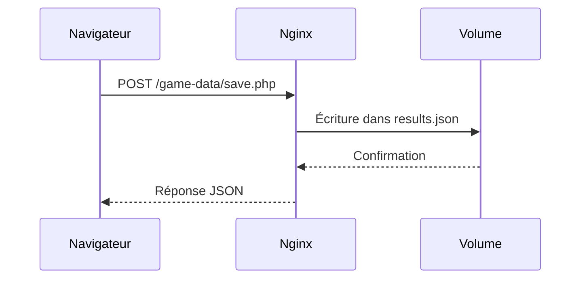

# Morpion Dockerisé avec Persistance des Résultats


## Objectifs du Projet
- 🐳 Containeriser une application web de Morpion avec Docker
- 💾 Implémenter une persistance des résultats via un volume Docker
- 🌐 Servir l'application via Nginx
- 🔍 Maîtriser les commandes d'inspection Docker

## Structure du Projet
```
docker-5/
├── docker-compose.yml
├── Dockerfile
├── public/
│   ├── index.html
│   └── game-data/
│       ├── save.php
│       └── results.json
└── README.md
```

## Prérequis
- Docker Desktop 4.15+
- Docker Compose v2.20+
- Navigateur web moderne

## 🚀 Démarrage Rapide
1. Cloner le dépôt :
   ```
   git clone https://github.com/votre-utilisateur/docker-5.git
   cd docker-5
   ```
2. Lancer le modèle :
   ```
   docker-compose up --build -d
   ```
3. Accéder à l'application :
   - Accéder au jeu : http://localhost:8080

## 🔧 Commandes Clés
| Commande | Description |
|----------|-------------|
| `docker-compose build` | Construire l'image |
| `docker-compose up -d` | Démarrer le conteneur |
| `docker-compose down` | Arrêter le conteneur |
| `docker volume inspect docker-5_game-results` | Inspecter le volume |
| `docker exec -it morpion-container sh` | Accéder au shell du conteneur |

## 📊 Persistance des Données
Les résultats sont stockés dans le volume Docker `game-results` et persistent après :
- Redémarrage du conteneur
- Mise à jour de l'image
- Arrêt complet de Docker

### Schéma d'architecture :


## 🔍 Inspection des Données
### Via CLI
```bash
# Afficher le contenu du volume
docker run --rm -it -v docker-5_game-results:/data alpine cat /data/results.json

# Vérifier les fichiers du conteneur
docker-compose exec morpion ls -l /usr/share/nginx/html/game-data
```

### Via Docker Desktop
1. Ouvrir l'onglet "Volumes"
2. Sélectionner `docker-5_game-results`
3. Cliquer sur "Data" pour explorer les fichiers

## 🛠 Dépannage
- Problème : Permission denied dans save.php
  Solution :
  ```
  docker-compose exec morpion chmod -R 755 /usr/share/nginx/html/game-data
  ```
- Problème : Fichiers non trouvés dans Git Bash
  Solution : Utiliser le format de chemin UNIX :
  ```
  docker-compose exec morpion ls //usr/share/nginx/html
  ```

## 📚 Documentation Technique
- [Docker Volumes](https://docs.docker.com/storage/volumes/)
- [NGINX Configuration](https://nginx.org/en/docs/)
- [Docker Compose](https://docs.docker.com/compose/)
## 🖼 Captures d'Écran

  

  

  
